# Implementation of a tool for stylometric analysis of the Quran

>An application for stylometric analysis of the Quran by different methods by Python 3.7

Please open an issue if you have any questions or comments at all !

## Installation
Use the package manager pip to install the necessary packeges.
```shell
pip install -r requirements.txt
```
After install the packages, run to start the application
```shell
python mainFrame.py
```

## Contents Guide

+ [Introduction](#introduction)
+ [Indexation](#indexation)
+ [Transliteration](#transliteration)
+ [Concordance](#concordance)
+ [Histogram](#histogram)
+ [Encoding Search](#encoding-search)

## Introduction
This application developed for making different analysis for the Quran.<br/>
The data downloaded from [Quranic Arabic Corpus](https://corpus.quran.com/download)


## Indexation
This is the first step of application before using the others.<br />
You can load an existing index or create a new one from the corpus downloaded.

## Transliteration
We used [Buckwalter transliteration](https://en.wikipedia.org/wiki/Buckwalter_transliteration)
for translate the arabic text to latin text and the reverse<br />
You can translate a custom text or choose the verses from Quran<br />
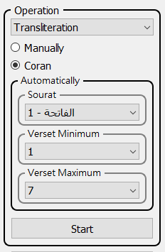 <br>
After clicking "Start" you see the verses on arabic and latin<br />
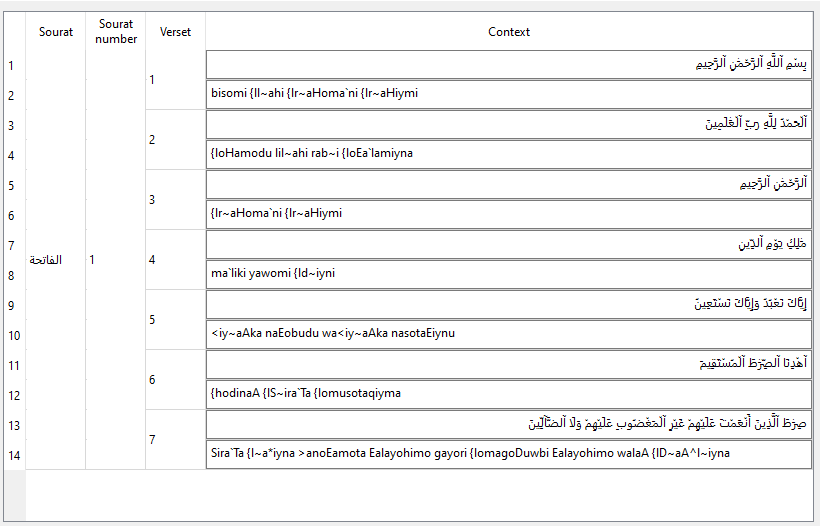<br>
You can save the result on text format
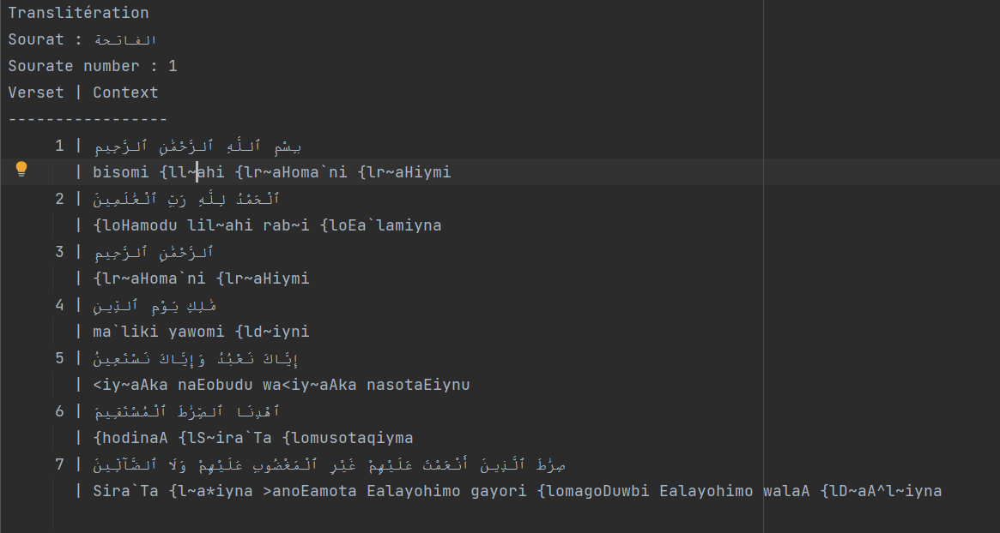

## Concordance
This feature is for search a word in the Quran<br>
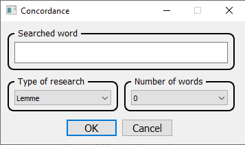<br>
type the word searched on arabic or latin then choose the type of searching by lemme or root or both
and last choose the number of words shown before and after the searched word on verse.<br>
The result:<br>
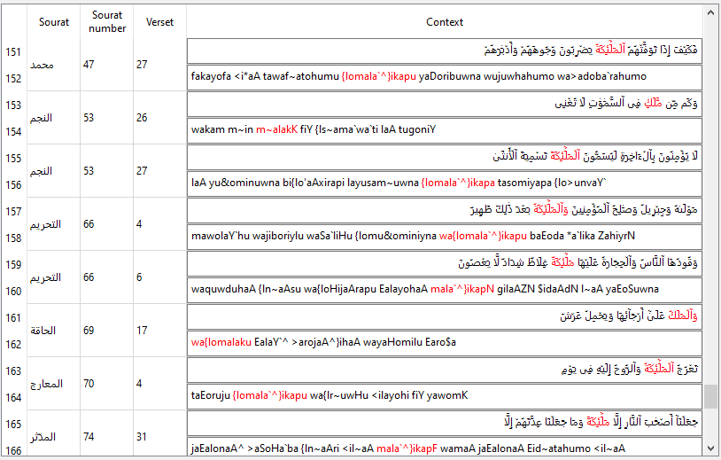<br>
You can save the result on text format<br>
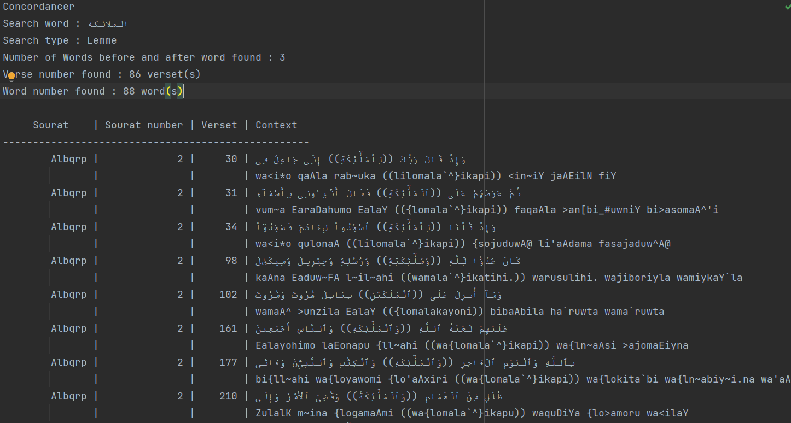

## Histogram
Plot a histogram of the ahkaam encoding (list of digits) of each verse in the Quran<br>
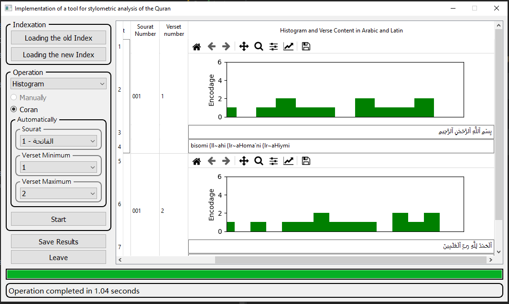<br>
You can save the result on folder with format "histogram_<sourat_num>_<verse_start>_<verse_end>" that contains images<br>


## Encoding Search
Search an encoding in the verse<br>
Choose operation "Encoding search" then Start.<br>
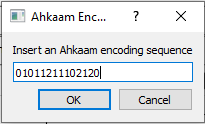<br>
An example we type: 01011211102120<br>
The result is in blue where we found the encoding in the verse
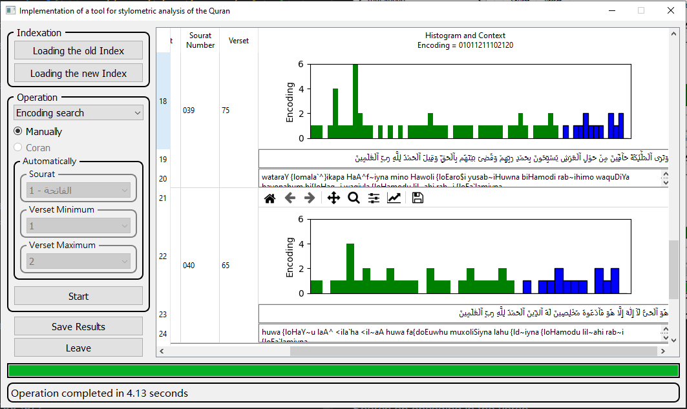<br>
You can save the result on folder with format "search_encoding_<encoding_search>" that contains images and text result<br>
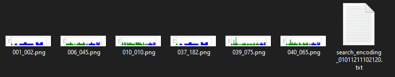<br>
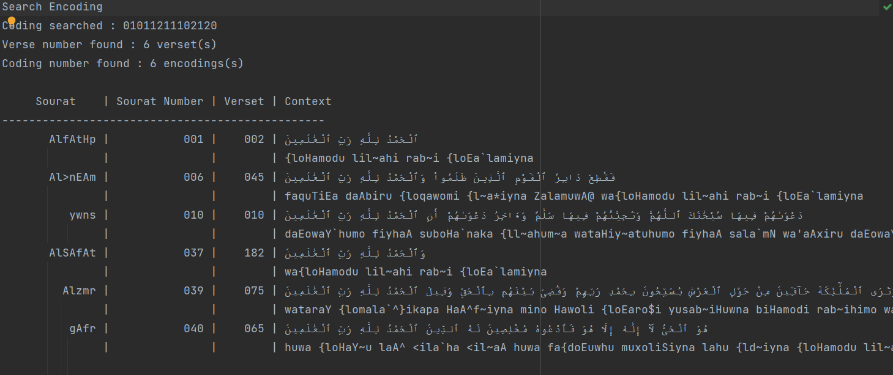<br>

